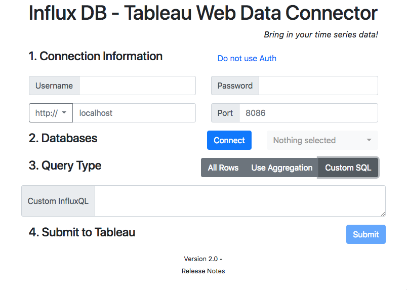

# InfluxDB_WDC
A Tableau Web Data Connector (WDC) to pull data from [InfluxDB](https://github.com/influxdata/influxdb)

Github Repository: [https://github.com/tagyoureit/InfluxDB_WDC](https://github.com/tagyoureit/InfluxDB_WDC)



## Release Notes
1. 2.0.1
    * Added fix for . (dot) in special characters
1. 2.0 -
    * Added Custom SQL - read more below for further details
    * Revamped UI
    * Removed https+influxdb:\\; It was only for embedded code.
    * Upgraded components Bootstrap 4, WDC 2.3, and other components.
    * Fixed issue with empty table crashing connector.
1. 1.4 - Added protocol <code>https+influxdb:\\</code> per Issue #4.
1. 1.3 - Additional error logging.
1. 1.2 - Added support for special characters - ` (space)`, `,`, `\ and /`, `' and "`,`-` and other special characters.
1. 1.1 - When editing a connection, the previous values will be restored (except for the password).  Increased, and dismissible, alert information.  Formatting of # of rows returned with ",".
1. 1.0 - Initial version

## Instructions

### Local install
* npm install influxdb_wdc
  OR
* Download the files and put them in a local web server.

* Open in Tableau 10.2+ and point to your URL.

### Use it in place

This is hosted by Github Pages.  To use it, open Tableau (10.2+), select "Web Data Connector" and point to this URL: [https://tagyoureit.github.io/InfluxDB_WDC/InfluxDB.html](https://tagyoureit.github.io/InfluxDB_WDC/InfluxDB.html)

#### Authorization
If you use authorization on your InfluxDB, you can click the link to reload the page with the username/password fields. Alternatively, add `?auth=true` or `?auth=false` to the end of the URL to access these directly.

## Features

* Basic Auth or no Auth
* Custom SQL
* Full or Incremental refresh
* Row count for extract creation progress

## How To Use

4 easy steps.
1. Enter your server details (protocol, hostname, port and optionally username/password)
2. Press connect to load the databases and then select the appropriate one
3. Choose the type of query you want (See details below)
4. Press Submit to load the schema into Tableau

### Query Types
#### All Rows
This is the most basic query.  It is equivalent to writing "select * from [measurement]" in InfluxQL CLI.  You will be presented with a schema in the Tableau Data Source page and can select your tables and Tableau will then load the data.  This will support Incremental refreshes.

#### Aggregation
This is a shortcut for simple aggregations.  You can choose one of 9 basic aggregations and the interval type (microseconds up to weeks) and the interval time.  Like with all rows, you will be able to select the specific tables you want at Tableau Data Source Screen and this supports Incremental Refreshes.

#### Custom SQL
This allows you to enter any custom sql that you could write into InfluxQL for any query not supported by the other two types.  In addition, this supports multiple statements and multiple series.

* Multiple statements - You can write multiple InfluxQL statements separated by ';'.  For example,
```
select * from tableA; select * from tableB
```
Tableau will load the schema for tableaA and tableB and you can choose to then load the data individually or join them together (see note on aggregation below).

* Multiple series - This connector supports grouping the data by series.  In InfluxQL if you write a sql statement like `select * from tableC group by "someTag"` and someTag has multiple values Influx will return multiple series.  See [group by](https://docs.influxdata.com/influxdb/v1.5/query_language/data_exploration/#group-by-tags) in the Influx help pages.  This connector will union all of the data in each series into a single table.  You can then format the data in any number of ways using Tableau.

You can combine multiple series and multiple statements with the custom sql option.  Incremental refreshes are not supported with custom sql at this time (please submit an issue if you feel this is important).

## Suggestions on use
### Tableau and Time Series
Tableau works great with time data, but time series metrics can be a challenge.  The most metrics you can have on a single graph is 2 (with Dual Axis).  If you want to show many metrics you'll want to create a dashboard with individual measurements.

### Aggregation
Aggregation is a great way to be able to do a row-level join on time series data that would otherwise not be joinable.  When you aggregate to any interval, Influx will "fill in" the missing values with nulls.  This should enable an inner join where you can use all of your data from a single Tableau Data Source.  In Tableau, use your table with earliest/latest dates and then connect to it with a left-outer join.

Aggregation can significantly decrease (or increase) the number of data points that are returned.  If your DB stores 1000 measurements per second, and aggregate up to the minute you'll reduce the data by 59,999 points per minute.  On the other hand, if you store 1 measurement per hour and aggregate by the milli-second you'll pull an extra 59,999 data points per minute.

If you don't aggregate the measurements, then you will likely want to create a separate Tableau Data Source for each measurement.

#### Do you need MAX in Tableau?
By default, Tableau will try to SUM all of your measurements.  If you bring data back and try to display it in Tableau at a higher level aggregation (eg you collect temperature readings every 20 minutes) and graph this at an hourly measurement, you may see you steady 80 degrees appear as 240 degrees!

## Limitations

Currently, the admin user is needed to populate the list of databases.  Once the extract is created if you want to refresh it you can enter a read (or write) only user account in Tableau.
